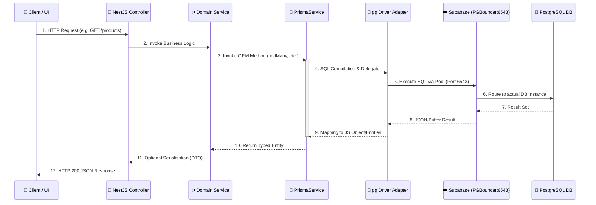

# Backend Data Flow: Supabase & Prisma Integration

Tài liệu này mô tả chi tiết luồng dữ liệu (Data Flow) trong hệ thống backend NestJS, tập trung vào sự kết hợp giữa **Supabase (Cloud Database)** và **Prisma 7 (ORM)**.

---

## 1. Tổng Quan Kiến Trúc Dữ Liệu

Hệ thống sử dụng mô hình **Tiered Architecture** kết hợp với **External Database Provider**. Dữ liệu không lưu cục bộ mà được lưu trữ trên nền tảng Supabase (AWS ap-northeast-1).

### Các Thành Phần Chính:
- **Supabase PostgreSQL**: Cơ sở dữ liệu chính, được cấu hình Connection Pooling qua PGBouncer.
- **Prisma 7**: ORM (Object-Relational Mapping) thế hệ mới, sử dụng Driver Adapter để tối ưu hóa hiệu năng Node.js.
- **@prisma/adapter-pg**: Cầu nối cho phép Prisma sử dụng thư viện `pg` (node-postgres) thay vì engine Rust mặc định, giúp giảm kích thước package và tăng tốc độ khởi động (cold start).

---

## 2. Sơ Đồ Luồng Dữ Liệu (End-to-End Flow)



---

## 3. Chi Tiết Các Tầng Xử Lý

### A. Tầng Cấu Hình (Connection Management)
Hệ thống sử dụng hai loại kết nối khác nhau để tối ưu hóa cho từng mục đích:

1. **Runtime Pool (`DATABASE_URL`)**:
   - Cổng: `6543` (PGBouncer).
   - Tham số: `?pgbouncer=true`.
   - Mục đích: Dành cho ứng dụng đang chạy (production/dev). Giúp quản lý hàng ngàn kết nối đồng thời mà không làm sập Database.
   - File cấu hình: `src/prisma/prisma.service.ts`.

2. **Migration/Direct (`DIRECT_URL`)**:
   - Cổng: `5432` (Direct PostgreSQL).
   - Mục đích: Dùng cho `prisma migrate` và các tác vụ CLI. Tránh xung đột với PGBouncer khi thực hiện thay đổi schema.
   - File cấu hình: `prisma.config.ts`.

### B. Tầng Thực Thi (`PrismaService`)
Khác với cấu hình Prisma mặc định, chúng ta sử dụng **Explicit Pooling**:

```typescript
// src/prisma/prisma.service.ts
const pool = new Pool({ connectionString: databaseUrl });
const adapter = new PrismaPg(pool);
super({ adapter });
```

- **Lợi ích**: Kiểm soát hoàn toàn số lượng kết nối tối đa (`max`), thời gian chờ (`idleTimeoutMillis`) thông qua cấu hình thư viện `pg`.
- **Driver Adapter**: Cho phép Prisma 7 chạy trực tiếp trên engine TypeScript/WASM, giảm đáng kể tài nguyên tiêu thụ.

---

## 4. Đặc Điểm Nổi Bật

1. **Incremental Update**: Dữ liệu từ Controller xuống DB luôn được validate qua DTO và bọc trong Transaction (nếu cần) để đảm bảo tính ACID.
2. **Cloud-Native**: Tận dụng AWS ap-northeast-1 từ Supabase để đảm bảo độ trễ thấp cho người dùng tại khu vực Châu Á.
3. **Type-Safety**: Toàn bộ luồng từ DB -> Prisma -> Service -> Controller đều được bảo vệ bởi TypeScript Types được generate tự động vào `./generated/prisma`.

---
*Tài liệu được tạo tự động và phân tích dựa trên cấu trúc codebase thực tế.*
