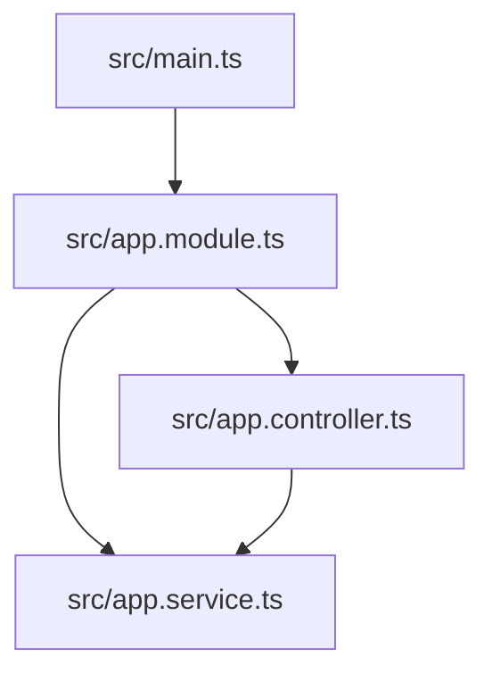

# Code Review Graph

## Project Structure
```text
.
├── docs
│   └── superpowers
│       ├── plans
│       │   └── 2026-05-12-nestjs-learning-dashboard.md
│       └── specs
│           └── 2026-05-12-nestjs-learning-dashboard-design.md
├── eslint.config.mjs
├── learn
├── nest-cli.json
├── package.json
├── package-lock.json
├── README.md
├── src
│   ├── app.controller.spec.ts
│   ├── app.controller.ts
│   ├── app.module.ts
│   ├── app.service.ts
│   └── main.ts
├── test
│   ├── app.e2e-spec.ts
│   └── jest-e2e.json
├── tsconfig.build.json
└── tsconfig.json
```

## Architectural Graph (Mermaid)


## Component Summaries
- **src/main.ts**: TypeScript functions (1 fn) - 8 lines | uses: @nestjs/core, ./app.module | patterns: async
- **src/app.module.ts**: TypeScript data structures (1 struct) - 10 lines | uses: @nestjs/common, ./app.controller, ./app.service
- **src/app.controller.ts**: TypeScript data structures (1 struct) - 12 lines | uses: @nestjs/common, ./app.service
- **src/app.service.ts**: TypeScript data structures (1 struct) - 8 lines | uses: @nestjs/common

## Token Efficiency (via RTK)
RTK is initialized and configured to proxy all commands through token-optimized filters.
Use `rtk gain` to see savings.
